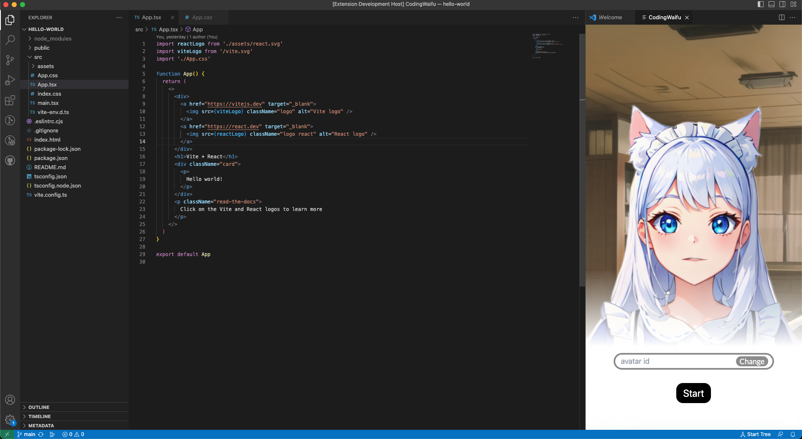

# CodingWaifu
CodingWaifu is a vscode extension that enhances your development workflow by providing a virtual anime assistant.
This assistant can help you execute Git commands and interact with you , making it feel like you have a real anime assistant by your side.

## Installation
You can install CodingWaifu from the Extensions side bar in VS Code, by searching for CodingWaifu.

## Usage
You can start Codingwaifu with command "Start Codingwaifu" from the Command Palette (⇧⌘P / ctrl + shift + p).

You can change the avatar by changing the avatar id. You can change it before clicking the "start" button at the start of the extension.

Leave the avatar id blank if you don't have avatar id, it will use default avatar automatically.

For different avatar id, you can generate it from [here](https://labs.avatech.ai) .

## License
This extension is licensed under the MIT License. See the LICENSE file for more details.

## Credits
The extension was developed using this [example](https://github.com/microsoft/vscode-webview-ui-toolkit-samples/tree/main/frameworks/hello-world-react-vite).
Special thanks to the creators of the example!
